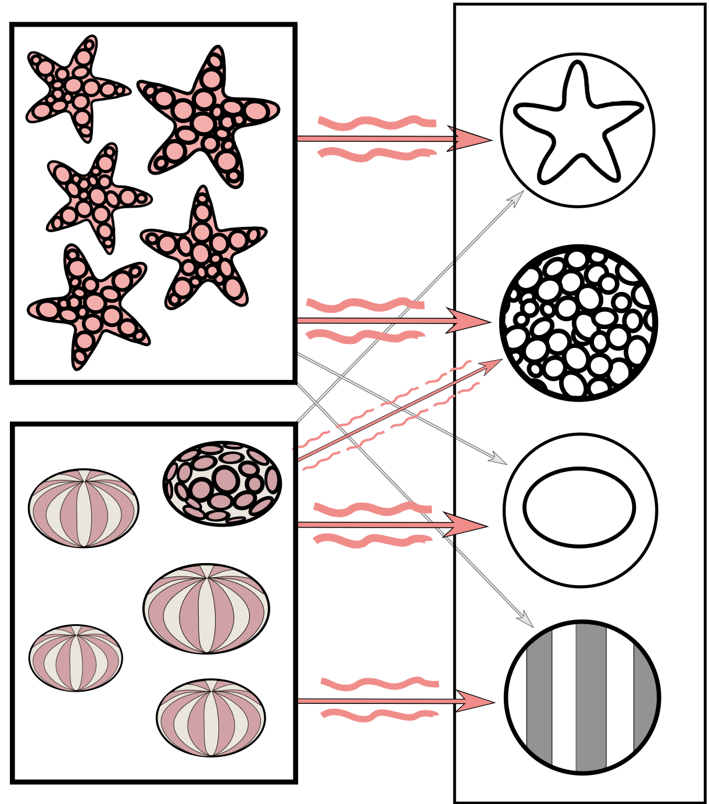
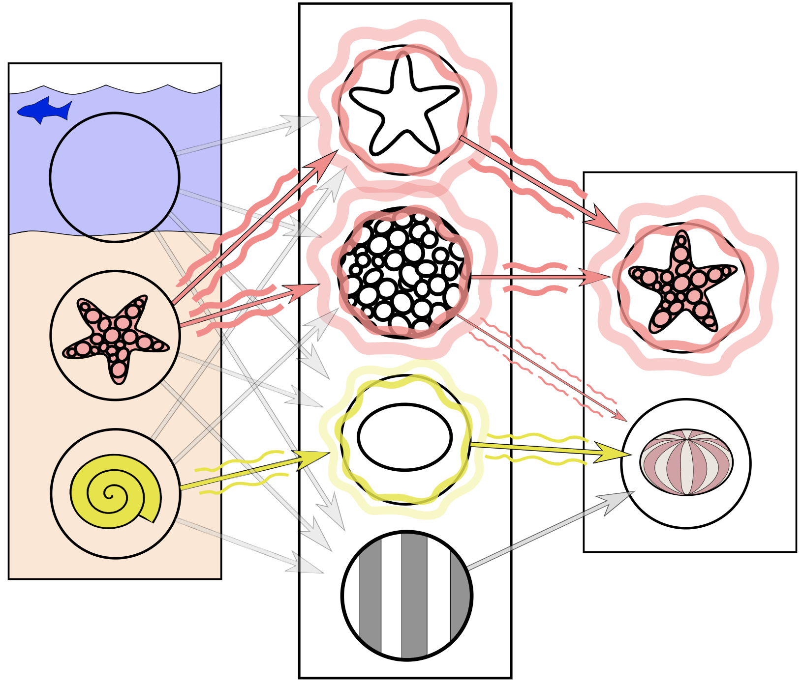
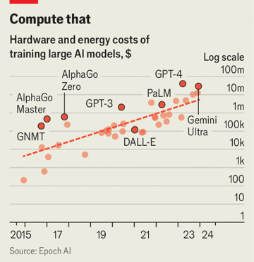

.center[

 
 
 
 

## A Deeper Dive into AI

 
 
 
 

Darren Kessner  
Marlborough School   
Educator Workshop  
October 4, 2024  

 
 

[dkessner.github.io/ai_pd_2024](http://dkessner.github.io/ai_pd_2024)  

]

---

### Linear regression

.split-60[

.column[

]
.column[
__Data__  
x: input  
y: output  
]

]

---

### Linear regression

.split-60[

.column[

]

.column[
__Data__  
x: input  
y: output  
  
__Model__  
line     
y = mx + b
  
__Parameters__   
m (slope)  
b (intercept)  

__Training / Learning__ 
finding the best parameters - 
minimizing a loss function

]
]

---

### Linear regression

.split-60[

.column[

]

.column[
__Data__  
x: input  
y: output  
  
__Model__  
line     
y = mx + b
  
__Parameters__   
m (slope)  
b (intercept)  

__Training / Learning__ 
finding the best parameters - 
minimizing a loss function

__Overfitting__  
using too many parameters

]
]

---

### Training the model

.split-50[

.column[

]

.column[
__Train the model__  

&nbsp; = learn from data

&nbsp; = find best parameters  

&nbsp; = minimize loss function  

 

__Gradient Descent__  

- give training data to model as input

- calculate gradient of loss function

- adjust parameters in the direction of the gradient

]
]

---

### Neural networks

.split-60[

.column[

 
 

 
 
 
<small>
Image credits:
[1](https://commons.wikimedia.org/wiki/File:Neuron3.svg)
[2](https://commons.wikimedia.org/wiki/File:Artificial_neuron_structure.svg)
[3](https://commons.wikimedia.org/wiki/File:Colored_neural_network.svg)
</small>

]

.column[
 

]

]

 

---

### Neural networks 

.center[

 

__Neural network__   
composition of functions   
(linear transformations / matrix multiplication)

 

__Backpropagation algorithm__  
calculation of gradient   
(chain rule)  

]

<small>
[Image credit](https://www.researchgate.net/figure/Example-of-simple-neural-network-architecture-with-linear-transformation-dense-layer-and_fig2_347965848)
</small>

---

### Computer vision

.split-50[

.column[

.center[__Training__]

 
 
<small>
Image credits:
[1](https://commons.wikimedia.org/wiki/File:Simplified_neural_network_training_example.svg)
[2](https://commons.wikimedia.org/wiki/File:Simplified_neural_network_training_example.svg)
</small>
]

.column[

.center[__Prediction__]
]

]

---

### Cosine similarity

.center[

]

$$
\cos \theta = \dfrac{u \cdot v}{|u||v|}
$$

---

### Semantic embedding

.split-60[

.column[

 
 
<small>
[Image credit](https://commons.wikimedia.org/wiki/File:Word_vector_illustration.jpg)
</small>

]

.column[
__Embedding__  

mapping of words to vectors in a high-dimensional vector space

__Semantic similarity__   

words with the same meaning have a higher
cosine similarity (shorter distance)

__Contextual embedding__

mapping of words depends on its context within a sentence

]

]

---

### Transformer architecture

 

2017 (Google) "Attention is All you Need" introduces the transformer
architecture

 
 

- model trained for text translation

- contextualization of embeddings

- parallelization / scaling to handle a large amount of training data

- foundation model pre-training + downstream fine-tuning

---

### Transformers history

- 2017 (Google) "Attention is All you Need": introduces the transformer
  architecture

- 2018 (Google) Bidirectional encoder representations from transformers
  (BERT): large language model using transformers

- 2018 (OpenAI) "Improving Language Understanding by Generative
  Pre-Training": GPT-1 released, using transformer architecture,
  unsupervised pre-training, fine-tuning for downstream tasks

- 2019 (OpenAI) GPT-2 released (closed, no source code)

- 2020 (OpenAI) GPT-3 released

- 2022 (OpenAI) ChatGPT released

- 2023 (OpenAI) GPT-4 released

- 2022-2024 Google Gemini, Anthropic Claude, Meta Llama, BLOOM, lots of others

---

### Large Language Models (LLMs)

- contextualization of embeddings
- pre-trained on large body of text
- trained to predict hidden (BERT) or next (GPT) word

 

GPT: Generative Pre-trained Transformer

.split-50[

.column[

Parameter counts

- GPT-1: 117 million
- BERT: 340 million
- GPT-2: 1.5 billion
- GPT-3: 175 billion
- BLOOM: 175 billion
- Llama 3.1: 405 billion
- Claude: 52 billion
- Claude 2-3: ?
- Gemini: ?
- GPT-4: ?
]

.column[

]

]

<!--
Economist Sep 19, 2024
-->

---

### Applications

 

Traditional
- audio analysis
- image analysis
- natural language processing

 

Generative
- text generation
- image generation
- drug discovery

---

### Topics for STEM classes

- Linear regression

 

- Linear algebra
    - vectors
    - dot product
    - matrix multiplication
    - linear transformations

 

- Calculus 
    - derivatives
    - minimization / maximization of functions
        - Newton's method
    - multivariable functions
        - gradients
    - chain rule

---

### Thank you!

.center[

 

 

dkessner.github.io/ai_pd_2024

]

