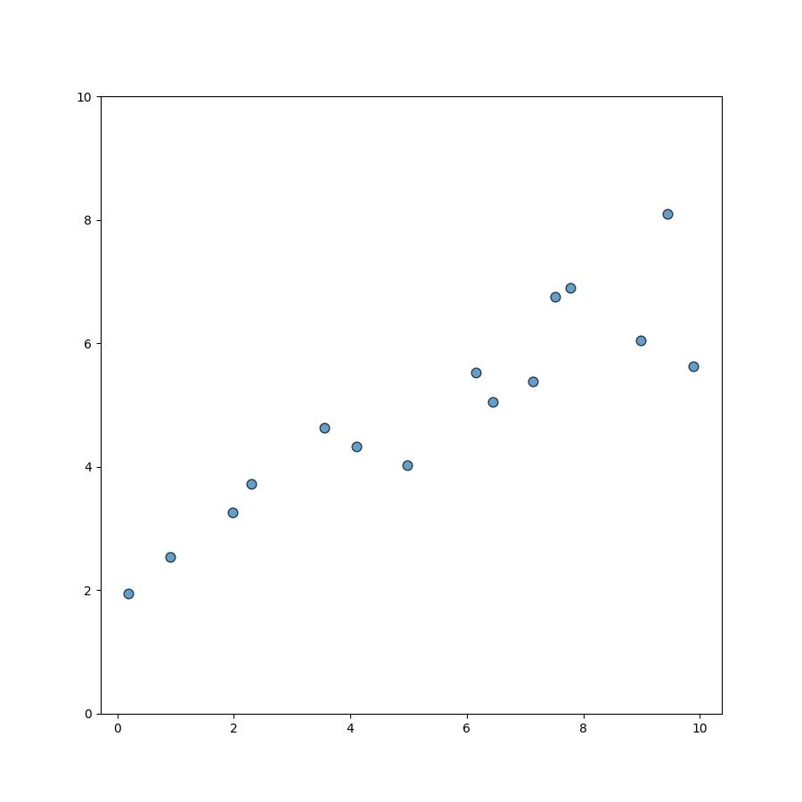
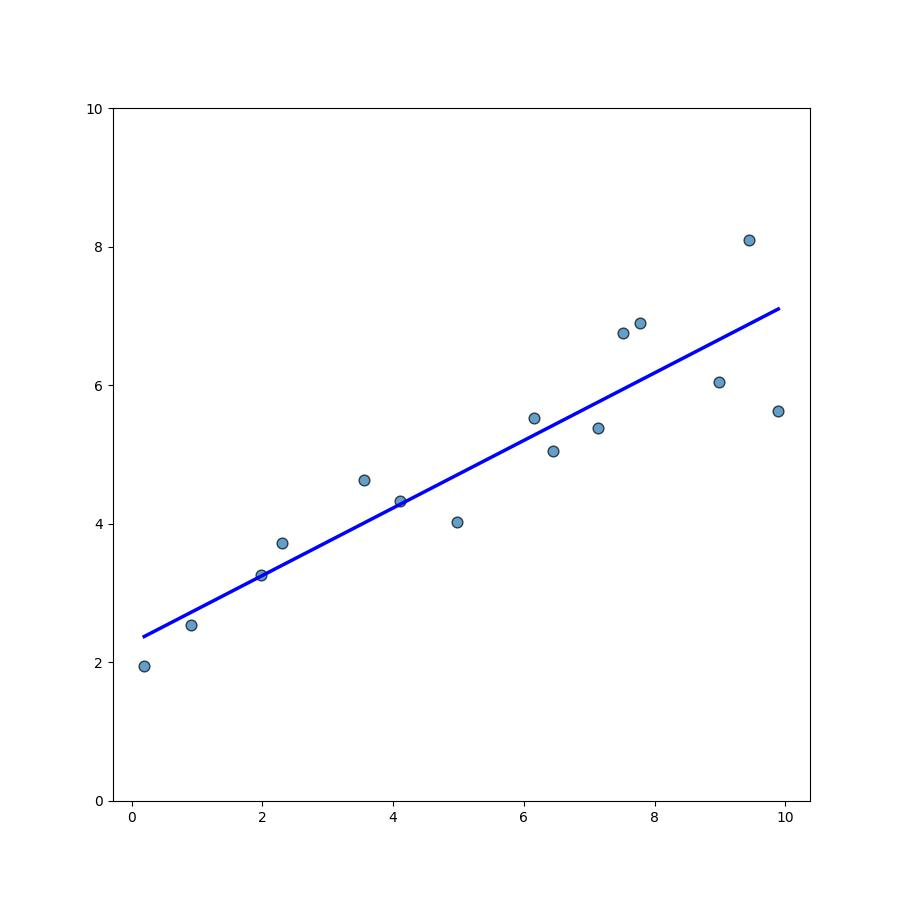
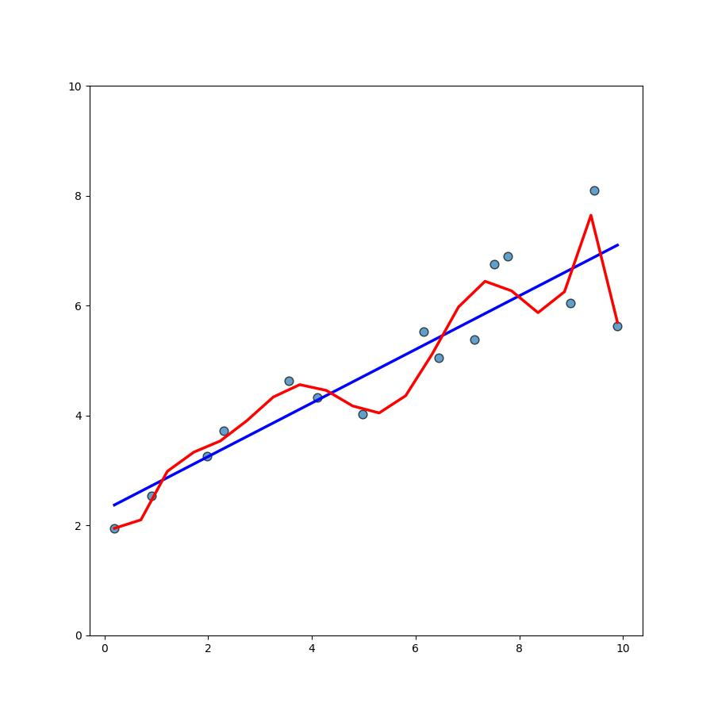
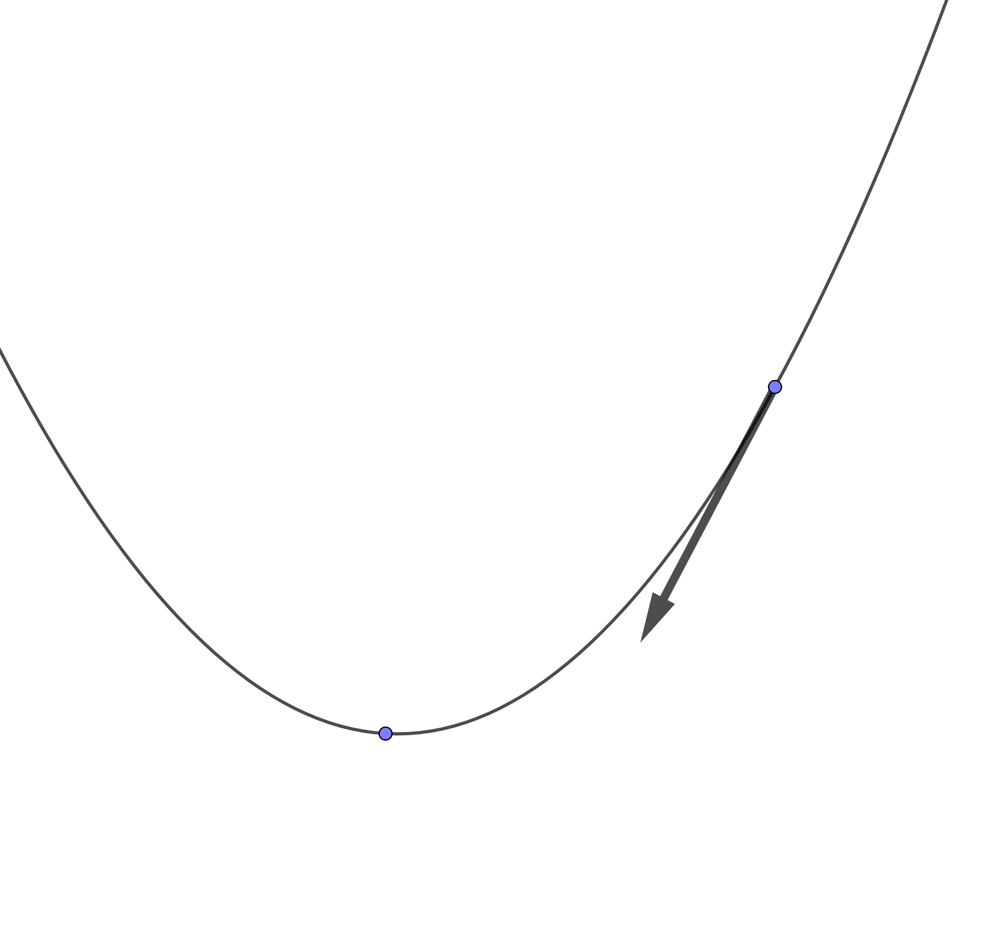
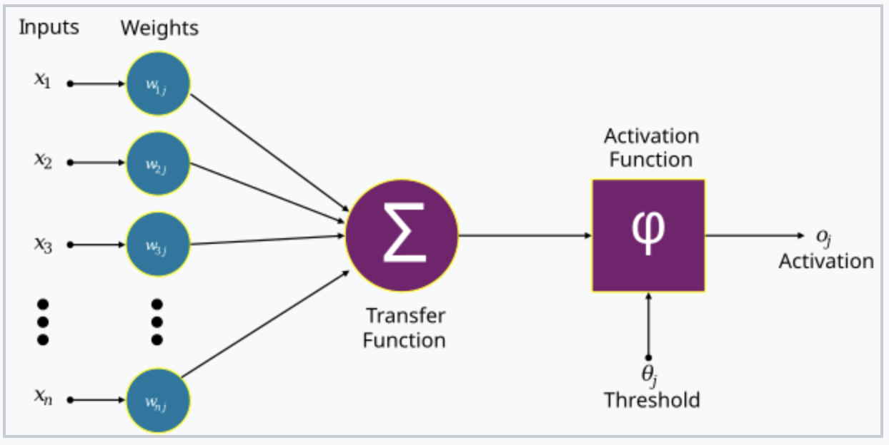
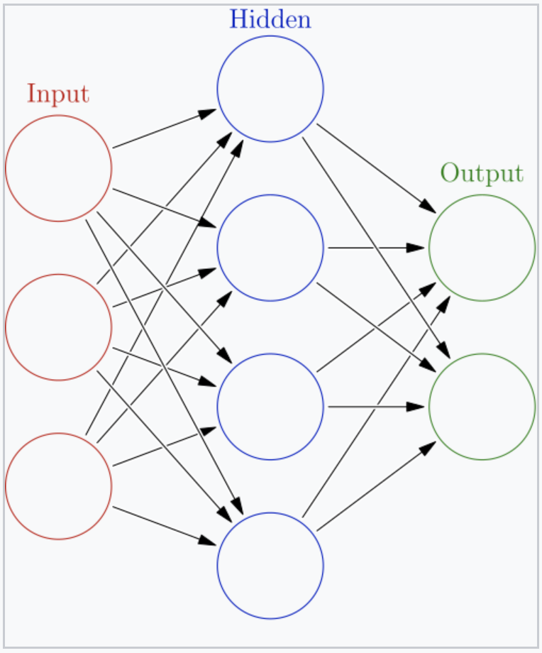
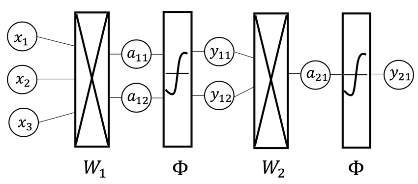
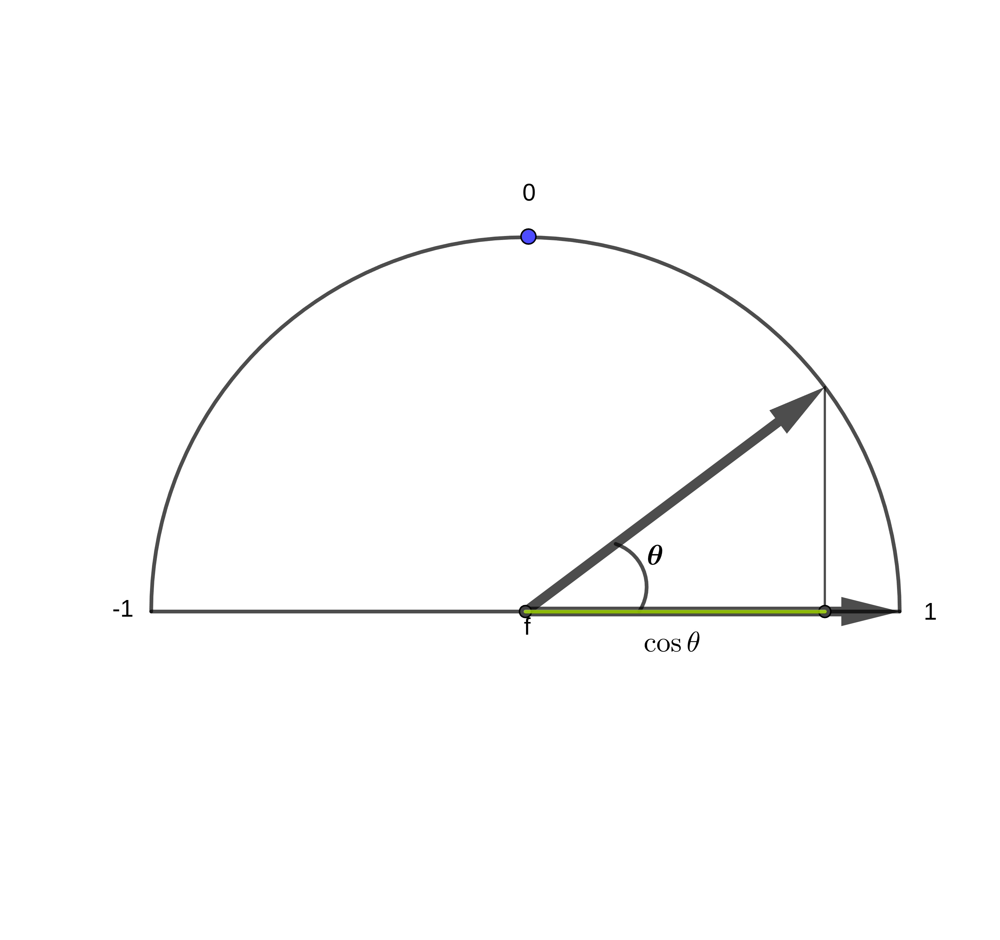
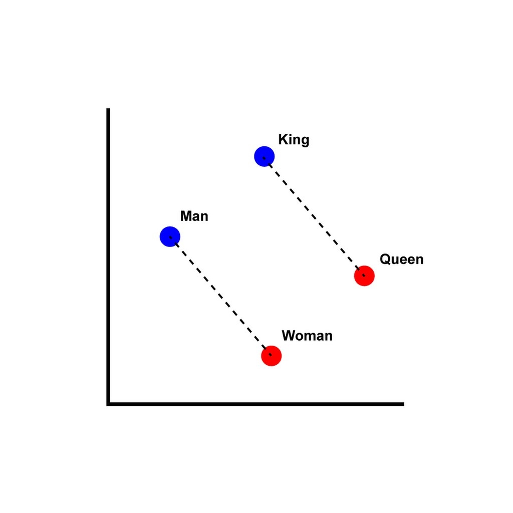

.center[

 
 
 
 

## A Deeper Dive into AI

 
 
 
 

Darren Kessner  
Marlborough School   
Educator Workshop  
October 4, 2024  

 
 

[dkessner.github.io/ai_pd_2024](http://dkessner.github.io/ai_pd_2024)  

]

---

### Linear regression

.split-60[

.column[

]
.column[
__Data__  
x: input  
y: output  
]

]

---

### Linear regression

.split-60[

.column[

]

.column[
__Data__  
x: input  
y: output  
  
__Model__  
line     
y = mx + b
  
__Parameters__   
m (slope)  
b (intercept)  

__Training / Learning__ 
finding the best parameters - 
minimizing a loss function

]
]

---

### Linear regression

.split-60[

.column[

]

.column[
__Data__  
x: input  
y: output  
  
__Model__  
line     
y = mx + b
  
__Parameters__   
m (slope)  
b (intercept)  

__Training / Learning__ 
finding the best parameters - 
minimizing a loss function

__Overfitting__  
using too many parameters

]
]

---

### Training the model

.split-50[

.column[

]

.column[
__Train the model__  

&nbsp; = learn from data

&nbsp; = find best parameters  

&nbsp; = minimize loss function  

 

__Gradient Descent__  

- give training data to model as input

- calculate gradient of loss function

- adjust parameters in the direction of the gradient

]
]

---

### Neural networks

.split-60[

.column[

 
 

]

.column[
 

]
]

---

### Neural networks 

.center[

 

__Neural network__   
composition of functions   
(linear transformations / matrix multiplication)

 

__Backpropagation algorithm__  
calculation of gradient   
(chain rule)  

]

---

### Cosine similarity

.center[

]

$$
\cos \theta = \dfrac{u \cdot v}{|u||v|}
$$

---

### Semantic embedding

.split-60[

.column[

]

.column[
__Embedding__  

mapping of words to vectors in a high-dimensional vector space

 

__Semantic similarity__   

words with the same meaning have a higher
cosine similarity (shorter distance)

]

]

